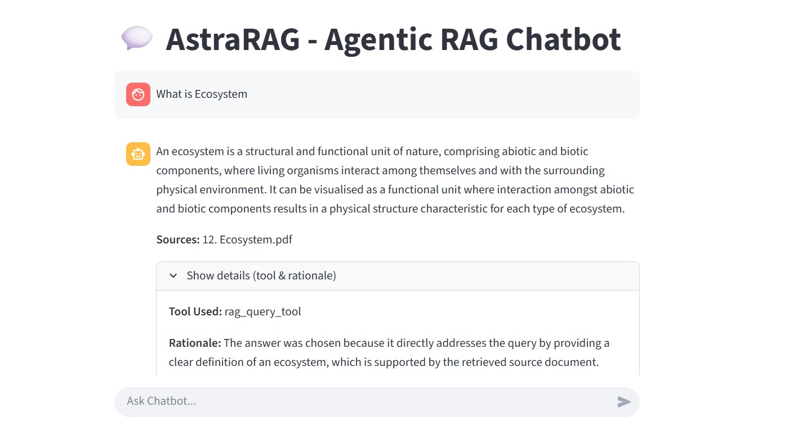
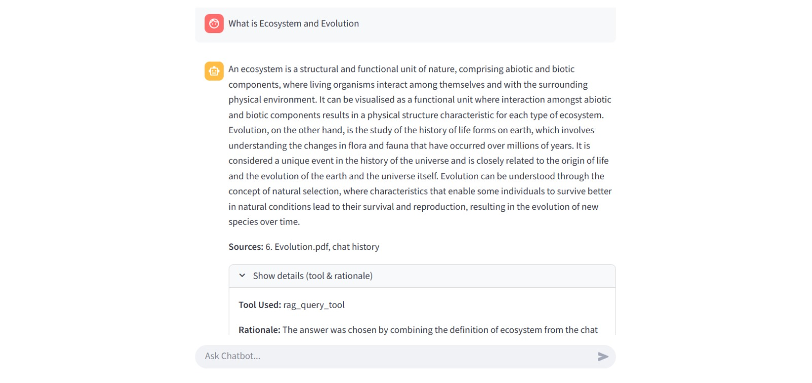
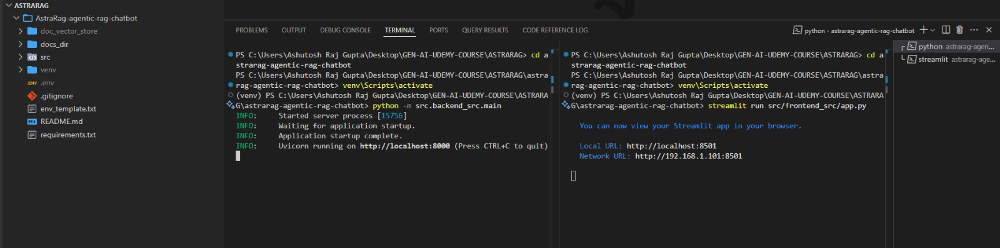
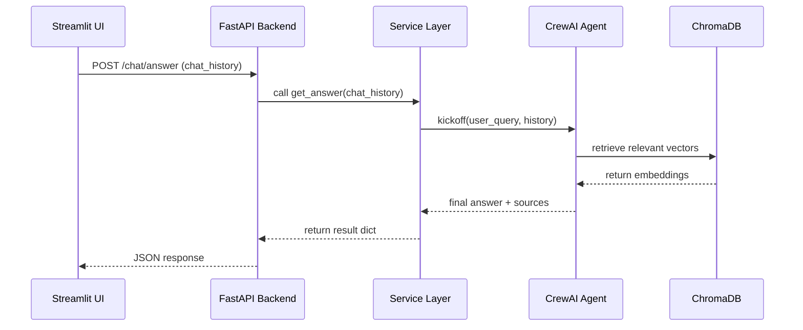

# 🚀 AstraRAG – Agentic RAG Chatbot

A fully modular **Agentic RAG Chatbot** built using **CrewAI** , **FastAPI** , **LlamaIndex** , **ChromaDB** , and a **Streamlit Frontend** .

This system combines:

- 🔹 **Agentic reasoning** (CrewAI)
- 🔹 **RAG pipeline** with Chroma vector database
- 🔹 **FastAPI backend** for orchestration
- 🔹 **Streamlit UI** for chatbot interaction
- 🔹 **Clean architecture** (agents → tasks → services → API → UI)

---

# 📸 Screenshots

### 🔹 Streamlit UI





### 🔹 Folder Structure



---

# ✨ Features

- 🤖 **Agentic Q&A chatbot** powered by CrewAI
- 📄 **Document ingestion pipeline** with LlamaIndex
- 🧠 **ChromaDB vector storage** with persistent embeddings
- ⚡ **FastAPI backend** to connect agents with frontend
- 🎨 **Streamlit frontend UI**
- 🔍 **Search + RAG retrieval + agent reasoning**
- 🧩 Modular file structure for scalability
- 🛠 Detailed logging for debugging

---

# 🏗 Tech Stack

### **Core**

- Python 3.10+
- CrewAI
- LlamaIndex
- FastAPI
- Streamlit

### **Vector DB**

- **ChromaDB**

### **Embeddings**

- HuggingFace Embeddings

### **Frontend**

- Streamlit

---

# 📁 Project Folder Structure

```
AstraRAG-agentic-rag-chatbot/
│
├── docs_dir/                     # Raw input documents
├── doc_vector_store/             # ChromaDB persistent embeddings
│
├── src/
│   ├── agents_src/               # CrewAI agents & tasks
│   │   ├── agents/
│   │   ├── tasks/
│   │   ├── crew.py
│   │
│   ├── rag_doc_ingestion/        # RAG ingestion pipeline (LlamaIndex)
│   │   ├── ingest_docs.py
│   │   ├── config/
│   │
│   ├── backend_src/              # FastAPI backend
│   │   ├── api/
│   │   ├── services/
│   │   ├── config/
│   │   ├── main.py
│   │
│   ├── frontend_src/             # Streamlit UI
│       ├── main.py
│       ├── config/
│
└── venv/
```

---

# 🧠 RAG Ingestion Pipeline

This pipeline converts raw documents into searchable vector embeddings.

### 🔹 Steps:

1. **Load documents** from `docs_dir/`
2. **Parse into text chunks** using LlamaIndex NodeParser
3. **Generate embeddings** using HuggingFace Embeddings
4. **Store embeddings** in ChromaDB (persistent directory)
5. Create a **VectorStoreIndex**

### ✨ Ingestion Code (Simplified)

```python
loader = SimpleDirectoryReader(input_dir=docs_dir)
documents = loader.load_data()

parser = SimpleNodeParser.from_defaults(chunk_size=1024, chunk_overlap=50)
nodes = parser.get_nodes_from_documents(documents)

vector_store = ChromaVectorStore(chroma_collection)
storage_context = StorageContext.from_defaults(vector_store=vector_store)

index = VectorStoreIndex(
    nodes,
    storage_context=storage_context,
    embed_model=embed_model
)
```

---

# 🔄 Backend Architecture (FastAPI → Services → CrewAI → Response)

This is the heart of your system.
Here is the clear workflow from frontend to backend to agent and back.

---

## 🔥 **Flow Overview**

### **1️⃣ User sends a query (Streamlit → FastAPI)**

Streamlit sends:

```
POST /chat/answer
```

Payload:

```json
{
  "chat_history": [{ "role": "user", "content": "Explain Quantum physics" }]
}
```

---

## **2️⃣ FastAPI Router Receives Request**

```python
@router.post("/chat/answer")
def chat_answer(request: ChatHistoryRequest):
    result = get_answer(chat_history)
    return result
```

---

## **3️⃣ Service Layer Processes Query**

`services/chat.py`:

```python
last_user_message = chat_history[-1]
user_query = last_user_message["content"]

result = qa_crew.kickoff({
    "user_query": user_query,
    "chat_history": history_without_last
})
```

This prepares:

- last user message
- chat history (context)
- input to CrewAI

---

## **4️⃣ Agentic Processing (CrewAI Agent + Task)**

CrewAI receives `user_query` and `chat_history`
Then:

- 🧠 Uses LlamaIndex retriever
- 🔍 Fetches top vector embeddings from Chroma
- 📝 Writes reasoning trace
- 🎯 Generates final answer

Crew returns a structured dict:

```json
{
  "answer": "...",
  "sources": ["doc1.txt"],
  "tool_used": "retrieval",
  "rationale": "Used RAG + agent reasoning"
}
```

---

## **5️⃣ FastAPI Returns JSON to Frontend**

Backend sends structured response.

---

## **6️⃣ Streamlit Renders UI**

UI shows:

- Assistant reply
- Sources
- Tool used
- Rationale (inside expander)

---

# 📊 Request Flow Diagram (Mermaid)



---

# 🧪 Running the Project

## 1️⃣ Install dependencies

```bash
pip install -r requirements.txt
```

## 2️⃣ Run RAG ingestion

```bash
python src/rag_doc_ingestion/ingest_docs.py
```

## 3️⃣ Start FastAPI backend

```bash
uvicorn src.backend_src.main:app --reload
```

## 4️⃣ Start Streamlit frontend

```bash
streamlit run src/frontend_src/main.py
```

---

# 🗂 Environment Variables

Create `.env` file:

```
DOCUMENTS_DIR=docs_dir
VECTOR_STORE_DIR=doc_vector_store
COLLECTION_NAME=astra_collection

API_HOST=127.0.0.1
API_PORT=8000
CHAT_ENDPOINT_URL=http://127.0.0.1:8000/chat/answer
```

---

# ⭐ Future Enhancements

- Add multi-agent workflow
- Add tool calling (browser, calculator, etc.)
- Add authentication for backend
- Deploy to cloud (AWS/GCP/Render/EC2)

---

# 🙌 About

Built by **Ashutosh Raj Gupta**
Designed for **Agentic RAG + LLM engineering practice**
